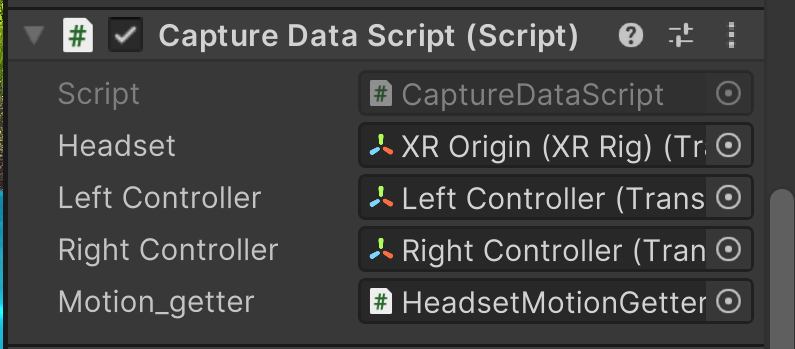
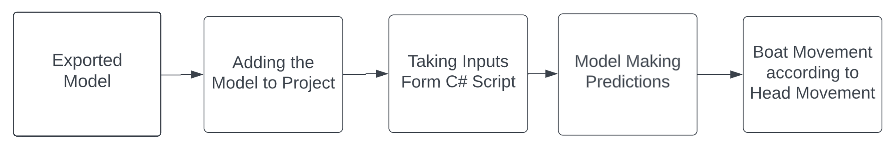
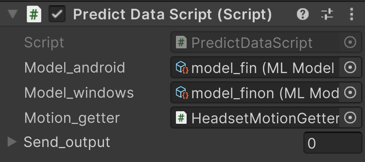
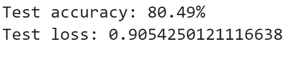

# VR_Rowing_AI_Neural_Network

By Aradhya Talawar

## Overview
This project is an exploration into combining Virtual Reality (VR) and Machine Learning (ML) to create a realistic rowing simulation. The aim is to simulate the experience of using a two-oar rowing machine, focusing on real-time boat navigation using IMU data from the Oculus Quest 2 VR headset within a Unity-based game environment. This approach eliminates the need for additional sensors on the oars, using ML algorithms to estimate the boat's direction and speed based solely on the headset's IMU readings.

[![Video for Data Collection]](https://youtu.be/R9O--jS1IAI)

## Abstract
The crux of this study lies in harnessing the power of C# to capture live VR headset IMU readings, which are then stored in CSV format. A custom ML model, trained using TensorFlow, predicts navigational outcomes that control the in-game boat's direction and speed, all integrated within Unity via the NatML framework. The results demonstrate that our ML model effectively translates head movements into meaningful in-game actions, significantly enhancing VR gaming interaction and intuitiveness.

## Flowchart

## Technology Used
* Game Engine: Unity
* ML Framework: TensorFlow
* VR Headset: Oculus Quest 2
* VS Code
* Google Collab
* NatML

## Design and Development
### Design
The design phase of this project was integral in creating an immersive and realistic virtual rowing experience. Key elements of the design include:

#### Environment Design in Unity:

Created a virtual rowing environment within Unity that mimics real-world rowing conditions. This involved designing water textures, environmental elements, and physics to simulate the natural rowing experience.
Attention was paid to the visual and interactive aspects to ensure a high degree of realism and user engagement.

#### Rowing Shell Design:

Developed a detailed 3D model of a rowing shell, incorporating aspects such as size, weight, and aesthetics to replicate an actual rowing boat.
Integrated the rowing shell model with the physics engine of Unity to ensure realistic movement and response to user inputs.
Flowchart for accurate smooth boat movement:

Nature Acting on the boat :

### Development
The development phase involved a series of steps, each critical to the project's success:

#### Data Collection and Storing:

Utilized the Oculus Quest 2 VR headset to collect Inertial Measurement Unit (IMU) data, capturing the user’s head movements during the rowing simulation.
Stored the IMU data in a CSV format, ensuring it was structured and accessible for further analysis and model training.
Flowchart for collecting data and storing them in a csv file:

* Flowchart for changing inputs according to the stage of the project
  1. Inputs from keyboard to check mechanism of the boat
  2. Inputs from the triggers from the controllers to store the data
  3. Imputs form the IMU's to navigate the boat according to the head movement.

#### Machine Learning Model Development:

Created a custom machine learning model using TensorFlow. This model was trained on the collected IMU data to predict navigational outcomes like the direction and speed of the rowing shell based on the user's head movements.
Focused on developing a model that accurately interprets IMU data while maintaining high performance and low latency to ensure real-time responsiveness in the VR environment.

* Model being trained

* Flowchart for training the model and then exporting it in .onyx and .tflite files to make predictions in game.

#### Integration with Unity using NatML:

The trained TensorFlow model was integrated into the Unity environment using the NatML framework.
This integration allowed the real-time application of the machine learning model within the game, translating the user's head movements into direct control of the rowing shell in the virtual environment.

* Flowchart for adding the model to the application for them to make predictions.

#### Testing and Refinement:

Conducted thorough testing to ensure that the rowing simulation responds accurately to user inputs.
Iteratively refined both the machine learning model and the Unity environment based on test results to enhance accuracy, responsiveness, and overall user experience.

## Results

The project successfully translated VR headset IMU data into precise control over the rowing simulation, overcoming challenges such as smooth boat movement, proper data formatting, and efficient development methodology.

Find the apk in the master repo currently you are in main.
